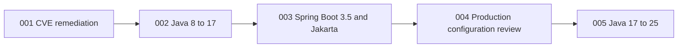

# Modernization Plan: Order Service Java 25 and Spring Boot 3.5

**Project:** Java Order Service  
**Source of truth:** `app/Java - Spring Boot/Order Service/assessment/assessment.md`

## Problem and Approach

Modernize only the Java Order Service from Java 8 to Java 25, Spring Boot
2.7.18 to 3.5.x, Jakarta EE 10, and remediated dependencies. Preserve the
assessment's incremental gates so compiler/runtime, framework/namespace,
configuration, and security failures remain independently diagnosable.

## Target-State Decisions

1. Remediate known direct CVEs before changing Java or Spring.
2. Upgrade Java 8 to 17, migrate Spring Boot/Jakarta, then upgrade 17 to 25.
3. Target Spring Boot 3.5.x; do not substitute Spring Boot 4.x.
4. Replace assessed `javax.persistence`/`javax.validation` imports with
   `jakarta` equivalents and replace `WebMvcConfigurerAdapter`.
5. Remove explicit Log4j Core if unused; if retained, use 2.23.1+. Upgrade
   Commons Text to 1.12.0.
6. Use Spring Boot 3.5 BOM-managed H2 2.2.x and validate Hibernate 6, the H2
   console, `DataSeeder`, and Order REST behavior.
7. Resolve wildcard CORS and `ddl-auto=update` as explicit production-readiness
   decisions. Preserve loopback binding and disabled remote H2 console access.
8. Exclude optional Java 21/25 language-feature adoption.

## Scope Boundaries

**Included paths/components**

- `app/Java - Spring Boot/Order Service/pom.xml`
- `app/Java - Spring Boot/Order Service/src/main/java/com/contoso/demo/orderservice/model/Order.java`
- `app/Java - Spring Boot/Order Service/src/main/java/com/contoso/demo/orderservice/web/OrderController.java`
- `app/Java - Spring Boot/Order Service/src/main/java/com/contoso/demo/orderservice/config/WebConfig.java`
- `app/Java - Spring Boot/Order Service/src/main/resources/application.properties`
- Runtime validation of `DataSeeder`, H2 console, and Order REST endpoints
- Existing Order Service tests as validation assets

**Excluded**

- Other applications and repository areas
- Infrastructure, containerization, deployment, and Azure service migration
- New authentication or Spring Security work
- Business behavior, persistence model, or REST contract changes
- Java modules and optional language refactoring
- Proactive changes to files the assessment marks as requiring no modification;
  tests change only for a focused migration-caused failure

## Prioritized Order and Dependency Graph

| Order | ID | Priority | Phase | Depends on | Parallelizable |
|---|---|---|---|---|---|
| 1 | `001-remediate-direct-cves` | P0 | 1 — Security baseline | None | No |
| 2 | `002-upgrade-java-8-to-17` | P1 | 2 — Runtime gate | 001 | No |
| 3 | `003-upgrade-spring-boot-3-5` | P1 | 3A — Framework migration | 002 | No |
| 4 | `004-review-production-configuration` | P1 | 3B — Configuration gate | 003 | No |
| 5 | `005-upgrade-java-17-to-25` | P1 | 4 — Target runtime | 004 | No |

Each task must leave a compiled, tested, startable application before its
dependent task begins.

## Executable Tasks

### 001-remediate-direct-cves

- **Priority and phase:** P0; Phase 1 — Security baseline
- **Scope and affected paths/components:** Order Service `pom.xml`, resolved
  Maven dependency tree, and active logging implementation.
- **Prerequisites:** Maven and a Java 8-compatible build environment.
- **Dependencies:** None.
- **Expected outcome:** Remove explicit Log4j Core 2.14.1 when unused, or raise
  it to 2.23.1+ when intentional; upgrade Commons Text to 1.12.0; eliminate the
  assessed vulnerable versions from resolved dependencies.
- **Risk and mitigation:** Removal could affect intentional logging and upgrades
  can expose transitive conflicts. Confirm the active logger, retain Log4j only
  when required, inspect `mvn dependency:tree`, and preserve Logback behavior.
- **Validation and acceptance criteria:** `mvn clean compile` and `mvn test`
  pass; startup has no logging errors; Order REST smoke tests pass; dependency
  scanning confirms remediation of CVE-2021-44228, CVE-2021-45046,
  CVE-2021-45105, CVE-2021-44832, and CVE-2022-42889.
- **Traceability:** Assessment §§2, 4, 5 Step 1, 6, 7, 8, and 9.
- **Safely parallelizable:** No; this establishes the shared `pom.xml` and
  security baseline.

### 002-upgrade-java-8-to-17

- **Priority and phase:** P1; Phase 2 — Runtime compatibility gate
- **Scope and affected paths/components:** Java version and Maven compiler
  source/target in Order Service `pom.xml`; full runtime validation on JDK 17.
- **Prerequisites:** Task 001 accepted; JDK 17 and Maven available.
- **Dependencies:** `001-remediate-direct-cves`.
- **Expected outcome:** Spring Boot remains 2.7.18 while the application
  compiles, tests, and starts on Java 17.
- **Risk and mitigation:** Java 17 can expose reflection/access restrictions.
  Diagnose these before changing framework versions or namespaces.
- **Validation and acceptance criteria:** Compile and all four assessed test
  classes pass under JDK 17; application startup, H2 console, seed rows, and
  `GET`, `POST`, and status `PATCH` Order endpoints work.
- **Traceability:** Assessment BLOCKER-3; §§5 Step 2, 6, 7, and 8.
- **Safely parallelizable:** No; this is the Spring Boot 3.5 prerequisite.

### 003-upgrade-spring-boot-3-5

- **Priority and phase:** P1; Phase 3A — Framework and namespace migration
- **Scope and affected paths/components:** Spring Boot version in `pom.xml`;
  persistence/validation imports in `Order.java`; validation import in
  `OrderController.java`; MVC configuration in `WebConfig.java`; H2 2.2.x,
  Hibernate 6, `DataSeeder`, and all Order REST endpoints.
- **Prerequisites:** Task 002 accepted; JDK 17 and Maven available.
- **Dependencies:** `002-upgrade-java-8-to-17`.
- **Expected outcome:** Spring Boot 3.5.x/Spring 6, Jakarta EE 10 persistence and
  validation APIs, `WebMvcConfigurer`, and preserved REST/persistence behavior.
- **Risk and mitigation:** Missed imports, removed Spring APIs, Hibernate 6, or
  H2 dialect changes can break compile/runtime. Limit namespace edits to
  assessed APIs and validate schema generation plus seed data at runtime.
- **Validation and acceptance criteria:** Compile/tests pass; no relevant
  `javax.persistence` or `javax.validation` imports remain; startup has no
  framework/schema exceptions; H2 console works at
  `http://127.0.0.1:8080/h2-console`; `DataSeeder` creates rows; assessed REST
  smoke tests preserve responses.
- **Traceability:** Assessment BLOCKER-1, BLOCKER-2, BLOCKER-4; §§2, 5 Step 3,
  6, 7, and 8.
- **Safely parallelizable:** No; these changes form one framework gate.

### 004-review-production-configuration

- **Priority and phase:** P1; Phase 3B — Production configuration gate
- **Scope and affected paths/components:** CORS in `WebConfig.java`; schema
  management in `application.properties`; preserve
  `spring.h2.console.settings.web-allow-others=false` and
  `server.address=127.0.0.1`.
- **Prerequisites:** Task 003 accepted against Spring Boot 3.5/Hibernate 6.
- **Dependencies:** `003-upgrade-spring-boot-3-5`.
- **Expected outcome:** Wildcard CORS is justified for a public unauthenticated
  API or replaced with approved origins before production.
  `ddl-auto=update` is confined to local/in-memory use or production uses
  `validate` with an approved Flyway/Liquibase strategy. No deployment
  assumption is invented.
- **Risk and mitigation:** CORS tightening can break legitimate clients; schema
  mode changes without migrations can block startup. Require an explicit
  disposition, preserve local behavior until production context is approved,
  and validate any changed profile.
- **Validation and acceptance criteria:** Both dispositions and environment
  boundaries are explicit; existing H2/loopback protections remain; any changed
  settings pass compile/tests/startup, allowed-origin checks, schema
  initialization, `DataSeeder`, and REST smoke tests.
- **Traceability:** Assessment §4 Security Configuration Observations; §§5
  Step 3, 6, 7, and 8.
- **Safely parallelizable:** No; this is the final Phase 3 gate.

### 005-upgrade-java-17-to-25

- **Priority and phase:** P1; Phase 4 — Target runtime
- **Scope and affected paths/components:** Java version and compiler settings in
  Order Service `pom.xml`; final build/runtime validation under JDK 25.
- **Prerequisites:** Task 004 accepted; JDK 25 and Maven available.
- **Dependencies:** `004-review-production-configuration`.
- **Expected outcome:** Java 25 with Spring Boot 3.5.x and preserved behavior;
  no optional records, sealed classes, text blocks, or other language refactors.
- **Risk and mitigation:** New runtime/compiler warnings can reveal
  incompatibilities. Keep the change runtime/compiler-only and inspect all new
  deprecation and unchecked warnings.
- **Validation and acceptance criteria:** Compile and all assessed tests pass
  under JDK 25; startup, H2 console, `DataSeeder`, and REST smoke tests pass;
  `-Xlint:deprecation -Xlint:unchecked` has no unaddressed migration warnings;
  the final dependency scan has no assessed CVEs.
- **Traceability:** Assessment target versions, BLOCKER-3; §§5 Step 4, 6, 7,
  and 8.
- **Safely parallelizable:** No; this is the final runtime gate.

## Validation Matrix

| Gate | Required evidence |
|---|---|
| Compile | `mvn clean compile` exits successfully with zero errors |
| Tests | `mvn test` passes all assessed Order Service test classes |
| Startup | `mvn spring-boot:run` starts without exceptions |
| Data | H2 console works and `DataSeeder` inserts seed rows |
| API | `GET /api/orders`, `POST /api/orders`, and status `PATCH` work |
| Security | Resolved dependency scan has no assessed vulnerable versions |
| Final JDK | JDK 25 lint build has no unaddressed migration warnings |

## Risks and Controls

- Keep CVE, JDK, Spring/Jakarta, configuration, and final JDK changes in
  separate accepted gates.
- Confirm Maven and each required JDK before its task; do not skip validation
  because Maven was unavailable on the assessment host.
- Resolve and scan the full Maven graph, not only direct dependencies.
- Preserve REST contracts, seed behavior, persistence semantics, logging, and
  local H2 protections.
- Do not touch unrelated applications or add deployment, infrastructure,
  authentication, or optional language refactors.

